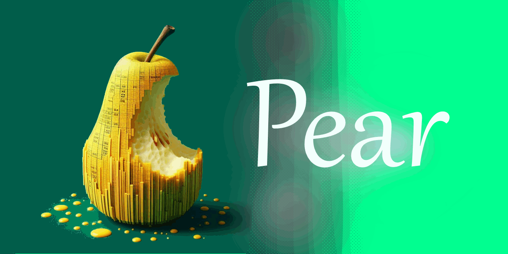
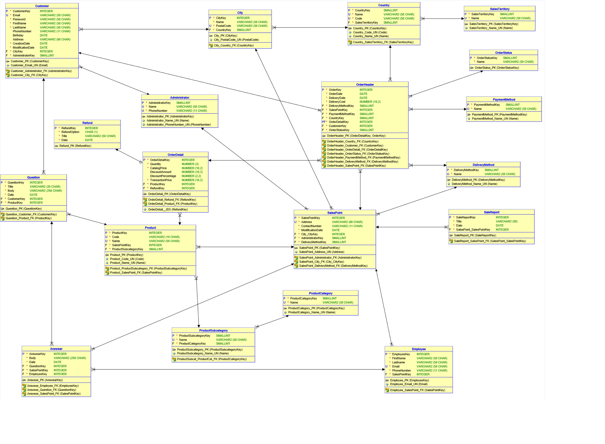

# Pear
Baza danych dla systemu sprzedaży produktów marki Apple 
SQL; Oracle Database; Informatyka l stopień 3 semestr  

## Logical database model

## Relational database model

## Team
- [Karol 🧔‍](https://github.com/Meister226)
- [Volodymyr 👨](https://github.com/volodymyr-tsukanov)
- [Yana 👩](https://github.com/Yannssaaaa)
- [Daniel 👨‍🦱](https://github.com/ThePundik)
