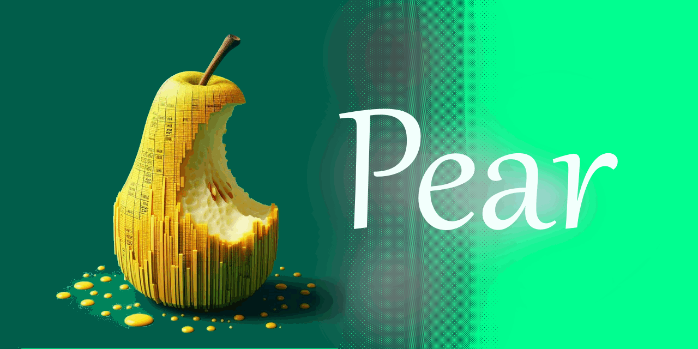
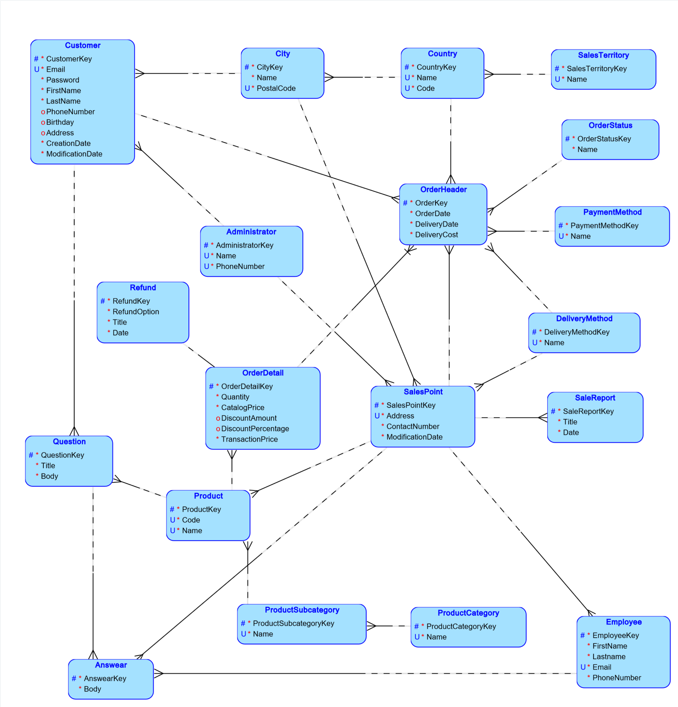
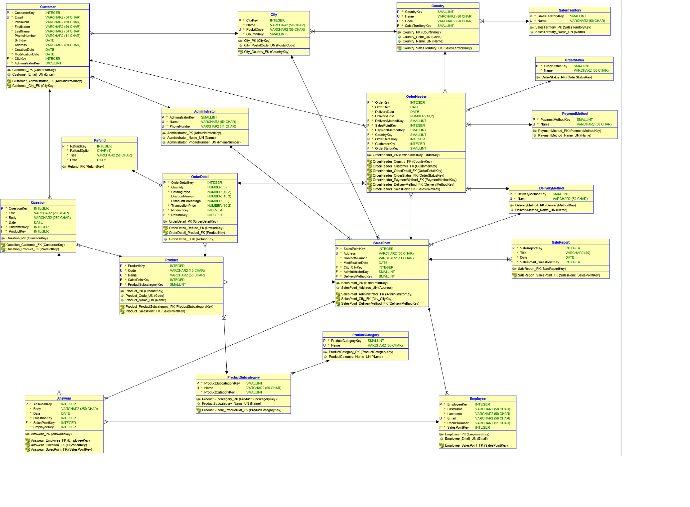

# Pear
Baza danych dla systemu sprzedaży produktów marki Apple  
**SQL**, **Oracle SQL Developer**; Informatyka Ⅰ stopień 3 semestr   

## Logical database model

## Relational database model

## Team
- [Karol 🧔‍](https://github.com/Meister226)
- [Volodymyr 👨](https://github.com/volodymyr-tsukanov)
- [Yana 👩](https://github.com/Yannssaaaa)
- [Daniel 👨‍🦱](https://github.com/ThePundik)
  

  

Shields: [![EPL-2.0][epl2-shield]][epl2]

[epl2]: https://www.eclipse.org/legal/epl-2.0/
[epl2-shield]: https://img.shields.io/badge/License-EPL%202.0-lightgrey.svg

 This work is licensed under the <a rel="license" href="https://www.eclipse.org/legal/epl-2.0/">Eclipse Public License 2.0</a>.
